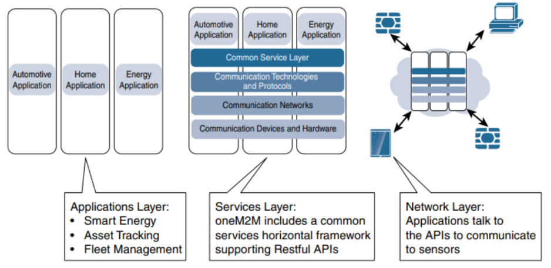

## Network Design & Architecture

Motives to learn,

- **Drivers Behind New Network Architectures**: OT, unique characteristics, constraints, unorthodox
- **Comparing IoT Architectures**: ETSI, IoTWF, architectures
- **A Simplified IoT Architecture**: Simplified model
- **The Core IoT Functional Stack**: Networking stack, sensors, application stack/layer
- **IoT Data Management And Compute Stack**: Data management, storage, compute resource models, IoT, Edge, Fog, Cloud Computing

## Table Of Contents

- [Network Design & Architecture](#network-design--architecture)
- [Table Of Contents](#table-of-contents)
- [IoT Architectural Drivers](#iot-architectural-drivers)
- [Comparing IoT Architectures](#comparing-iot-architectures)
- [M2M IoT Architecture](#m2m-iot-architecture)
- [The IoT World Forum (IoTWF) Standardized Architecture](#the-iot-world-forum-iotwf-standardized-architecture)
- [A Simplified IoT Architecture](#a-simplified-iot-architecture)
- [Core IoT Functional Stack](#core-iot-functional-stack)
- [Layer 1: "Things" Sensors And Actuators Layer](#layer-1-things-sensors-and-actuators-layer)
- [Mobility vs Throughput](#mobility-vs-throughput)
- [Layer 2: Communications Network Layer](#layer-2-communications-network-layer)
  - [Access Network Sublayer](#access-network-sublayer)
    - [Point-To-Point Topologies](#point-to-point-topologies)
    - [Point-To-MultiPoint Topologies](#point-to-multipoint-topologies)
  - [Gateways & Back-haul Sublayer](#gateways--back-haul-sublayer)
  - [Network Transport Sublayer](#network-transport-sublayer)
  - [IoT Network Management Sublayer](#iot-network-management-sublayer)
- [Layer 3: Applications & Analytics Layer](#layer-3-applications--analytics-layer)
  - [Analytics Vs Control Applications](#analytics-vs-control-applications)
    - [Analytics Application](#analytics-application)
    - [Control Application](#control-application)
  - [Data Versus Network Analytics](#data-versus-network-analytics)
    - [Data Analytics](#data-analytics)
    - [Network Analytics](#network-analytics)

## IoT Architectural Drivers

Some challenges to address

- **Scale**: Massive scale, IoT, sensors. IPv4 is exhausted, scalability requirements, IPv6, NAT
- **Security**: WSNs, security strategy, zero touch deployment model
- **Devices**: Constrained by power, CPU, memory, link speed. Lossy, minimal data rates. Last-mile wireless technologies needed
- **Data Generation**: Massive volumes, daily basis, bottlenecks, analytics/applications typically run only in the cloud
- **Support**: Legacy, IP-capable endpoints, legacy non-IP devices, relying on serial/proprietary protocols. Protocol translation
- **Analysis**: Analysis in real time. Stream processing

(SSDDSA)

## Comparing IoT Architectures

These architecture must support,

1. Data
2. Process
3. Functions

Best-known architectures are those supported by oneM2M, and IoTWF

## M2M IoT Architecture

1. Applications Layer,
   1. Smart Energy
   2. Asset Tracking
   3. Fleet Management
2. Services Layer,
   1. oneM2M includes a common services horizontal framework supporting RESTful APIs
3. Network Layer,
   1. Applications talk to the APIs to communicate to sensors

## The IoT World Forum (IoTWF) Standardized Architecture

1. Collaboration & Processes
2. Application
3. Data Abstraction
4. Data Accumulation
5. Edge Computing
6. Connectivity
7. Physical Devices & Controllers

OT vs IT. Data in month. Organized. "Data In Motion". "Data At Rest".

## A Simplified IoT Architecture

1. **Core Iot Functional Stack**: Applications <-> Communications Network <-> Things: Sensors & Actuators
2. **IoT Data Management & Compute Stack**: Cloud <-> Fog <-> Edge

## Core IoT Functional Stack

1. "Things" Layer
2. Communications Network Layer
   1. Access Network Sublayer
   2. Gateways & Back-haul Network Sublayer
   3. Network Transport Sublayer
   4. IoT Network Management Sublayer
3. Application & Analytics Layer

## Layer 1: "Things" Sensors And Actuators Layer

1. **Battery-Powered Or Power-Connected**
2. **Mobile Or Static**
3. **Low Or High Reporting Frequency**
4. **Simple Or Rich Data**
5. **Report Range**

## Mobility vs Throughput

1. *High Mobility vs High Throughput*: Video Surveillance
2. *High Mobility vs Low Throughput*: Battlefield Communications
3. *Low Mobility vs High Throughput*: Traffic Cameras, Connected Electronics
4. *Low Mobility vs Low Throughput*: Industrial, Environment, Home, Retail

## Layer 2: Communications Network Layer

### Access Network Sublayer

Key point is of the choice of the *access technology*, the range between the smart object, the information collector.

For example,

1. **<10 cm**: NFC, EMV
2. **<5 km**: WNAN, WLAN, WFAN, WHAN, WPAN
3. **100 km**: Cellular, LPWA (Licensed), LPWA (Un-Licensed), WWAN

#### Point-To-Point Topologies

When each object establishes an individual session with the gateway.

#### Point-To-MultiPoint Topologies

Supporting both data collection and forwarding functions. Some other nodes collect smart object data, sometimes instruct the sensor to perform specific operations.

For example, Star vs Clustered technologies.

### Gateways & Back-haul Sublayer

Needing to be forwarded to another medium is a back-haul, so that it can be transported to a central station.

### Network Transport Sublayer

- Peer-To-Peer
- Point-To-Point
- Point-To-MultiPoint
- Unicast
- Multicast
- Wi-Fi
- ZigBee

### IoT Network Management Sublayer

TCP, UDP, connectivity. Push model, whereas others rely on a pull model. Multiple hybrid approaches are also possible.

## Layer 3: Applications & Analytics Layer

Making use of information exchanged with the smart objects

### Analytics Vs Control Applications

Analyzing data, architectural standpoint

#### Analytics Application

Multiple smart objects, processes the collected data

#### Control Application

Behavior of smart object

### Data Versus Network Analytics

Analytics is a general term that describes processing information to make sense of the collected data.

In the world of IoT, a possible classification of the analytics function is as follows,

1. Data Analytics
2. Network Analytics

#### Data Analytics

Dashboard, sensors provide data, monitoring, analytics application.

#### Network Analytics

Smart objects over the network. Operations efficiency. 
